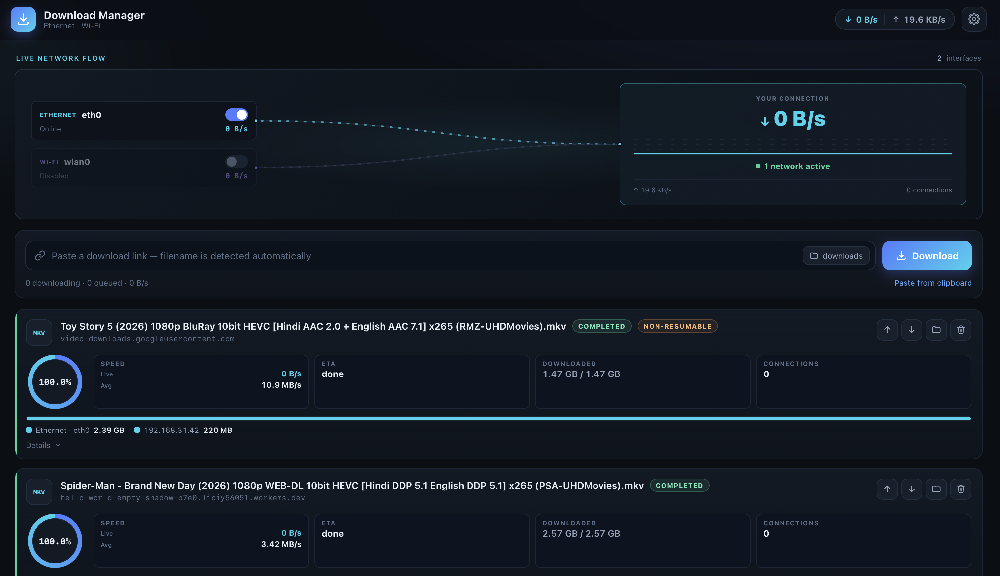
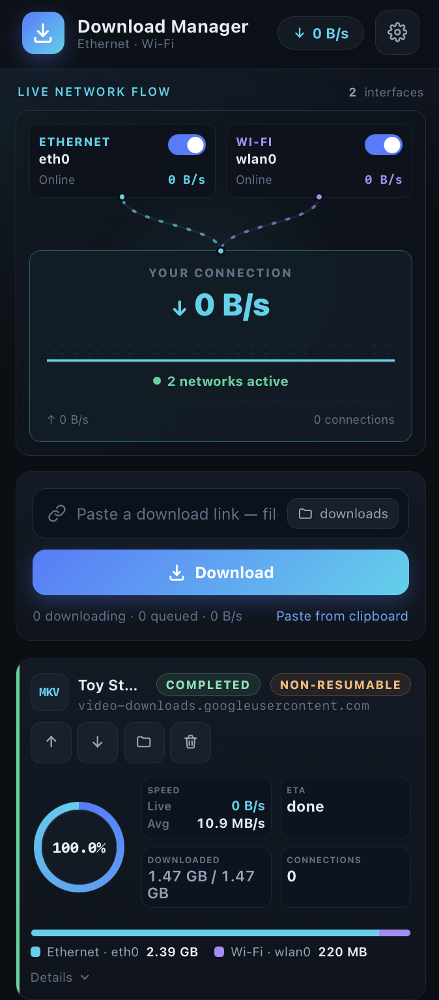

# Unique Download Manager

A self-hosted, multi-connection download manager for macOS / Linux that splits a file
into chunks and downloads them in parallel across all of the machine's network
interfaces (Wi-Fi, Ethernet, USB tethering, …) at once. Resume, queueing with
priorities, and a live web UI are built in.

## Features

- **Parallel chunked downloads** — one HTTP range request per chunk, written into a
  preallocated `.part` file so every byte lands at the right offset.
- **Multi-network load balancing** — each chunk worker binds to a specific local
  interface IP (`source_address` in urllib3). The engine measures each NIC's live
  throughput and gives faster links more of the task's connection budget, while
  guaranteeing every enabled NIC gets at least one slot.
- **Pause / resume** — state is flushed to disk; resumes continue from the exact byte.
  Remote changes are detected via ETag/`If-Range` and restart cleanly.
- **Robustness** — retries with exponential backoff on network loss or 429/5xx;
  servers that ignore `Range` (or break it mid-download) fall back to a single
  connection automatically; HTML/login pages are rejected with a clear error.
- **Queue + priorities** — `max_downloads` concurrent tasks, priority-ordered.
- **Live web UI** — single-page dark-themed interface with SSE real-time progress,
  combined and per-NIC speed readouts, and a server-side directory browser.

## Screenshots

| Desktop | Mobile |
|:--:|:--:|
|  |  |

## Quick start

```sh
python3 -m venv venv
venv/bin/pip install -r requirements.txt
venv/bin/python app.py                 # serves http://127.0.0.1:8765
```

To use the `start.sh` launcher, run it from the project directory:

```sh
./start.sh
```

It starts the server in the background at <http://127.0.0.1:8765> and writes
logs to `logs/access.log` and `logs/error.log`. Use `./start.sh --debug` to run
in the foreground, or `./start.sh --help` for the launcher's options. The script
currently fixes the bind address to `0.0.0.0` and the port to `8765`; it does not
accept `--host` or `--port` arguments.

On Linux, the launcher may use `sudo` to install `lsof` and add an inbound
iptables rule for port 8765. If that port is already occupied, it asks before
force-killing the process using it. The app has no authentication, so only run
this launcher on a trusted network. For a foreground launch without these
launcher side effects, use `venv/bin/python app.py --host 127.0.0.1 --port 8765`.

### CLI options

```
venv/bin/python app.py [--host 127.0.0.1] [--port 8765] [--dir ~/Downloads] \
                       [--data-dir ./db] [--debug]
```

- `--dir` — default download directory.
- `--data-dir` — where `settings.json` + `downloadings.json` live (default `./db`
  in the project directory, or `UDM_HOME`).

### Run as a system service on Jetson

The sample unit at `deploy/unique-download-manager.service` runs as `raj`, uses
the project virtualenv, and listens on `0.0.0.0:5000`. Stop any manually started
instance first so it releases port 5000, then run on the Jetson:

```sh
cd ~/Development/unique_download_manager
sudo install -D -m 644 deploy/unique-download-manager.service /etc/systemd/system/unique-download-manager.service
sudo systemctl daemon-reload
sudo systemctl enable --now unique-download-manager.service
sudo systemctl status unique-download-manager.service --no-pager
```

The service starts after reboot and restarts after unexpected failures. Follow
its logs with `sudo journalctl -u unique-download-manager.service -f`. The unit
uses Jetson-specific paths; update `User`, `WorkingDirectory`, and `ExecStart`
when installing on another machine.

### Restart safety

State is persisted to the data directory (`./db/settings.json` for settings,
`./db/downloadings.json` for the task list) plus per-task `.udm/<id>.json`
metadata next to each `.part` file. On startup the manager rebuilds the task list
from these files and **automatically resumes every download that was running** when
the server stopped; tasks you had explicitly paused stay paused.

## API

| Method | Route | Description |
| ------ | ----- | ----------- |
| GET | `/api/snapshot` | Tasks, per-NIC stats, systems settings |
| GET | `/api/events` | SSE stream (progress, speeds) |
| POST | `/api/add` | `{url, directory?, priority?}` → new task |
| POST | `/api/tasks/<id>/pause` / `resume` / `cancel` | Lifecycle |
| POST | `/api/tasks/<id>/priority` | `{delta: ±1}` |
| DELETE | `/api/tasks/<id>` | Remove (auto-cancel if active) |
| GET/POST | `/api/settings` | Directory, concurrency, per-NIC enable |
| GET | `/api/fs?path=` | Directory browser (dirs only) |
| POST | `/api/open` | Reveal file/folder in the OS file manager |

## Tests

```sh
venv/bin/python tests/smoke_test.py
```

Runs a local fixture server and exercises 37 checks: parallel byte-exact downloads,
pause/resume, offline → `waiting_network` → auto-recovery, no-Range fallback,
priority queueing, NIC load balancing, and snapshot shape.

## How it works

```
Browser (UI)
   │  REST + SSE
   ▼
Flask (app.py) ──── routes on the left
   ▼
DownloadManager (engine/manager.py)
   ├─ scheduler: starts queued tasks up to max_downloads by priority
   ├─ sampler:   1 s speeds per NIC/task, EMA, history
   ├─ saver:     persists state.json + per-task metadata
   └─ per-task thread: resolve meta → prepare storage → manage chunk workers
        └─ chunk workers — each a requests session bound to one interface IP
```

- The sampler measures both app-level throughput (window counters updated by each
  worker per 256 KB piece) and system-wide per-NIC RX/TX via `psutil`.
- Chunk size is chosen from the file size and connection count (4–16 MB, ≤64 chunks,
  one chunk for unknown-length or no-Range sources).
- Each task run is tagged with a generation counter so pause/resume can never leave
  two live runs writing the same file.